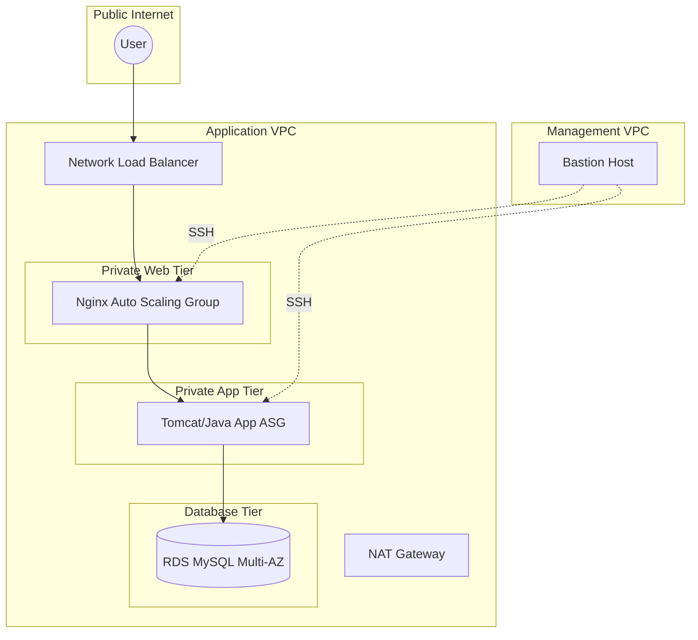

# 🚀 AWS 3-Tier Automated Infrastructure & CI/CD Pipeline

[](https://www.terraform.io/)
[](https://aws.amazon.com/)
[](https://github.com/features/actions)
[](https://docs.github.com/en/actions/deployment/security-hardening-your-deployments/about-security-hardening-with-openid-connect)

A production-grade, highly available 3-tier web architecture on AWS. This project focuses on **modern DevOps practices**, replacing legacy artifact management with GitHub-native tools and securing the cloud-to-runner handshake with OIDC.

---

## 🏗️ Architecture Design

The infrastructure is split across two VPCs (Management and Application) linked by a **Transit Gateway** to simulate a real-world enterprise environment.



## 🛠️ Tech Stack & Decisions

- Infrastructure: Terraform (Modularized for VPC, SG, and Compute).

- CI/CD: GitHub Actions replacing Jenkins for faster, serverless builds.

- Artifact Registry: GitHub Packages replacing JFrog Artifactory.

- Database: Amazon RDS with Multi-AZ failover.

- Security: Keyless Authentication via OpenID Connect (OIDC) between GitHub and AWS.

## 🛡️ DevOps Best Practices Implemented

- Remote State Management: Terraform state is stored in S3 with state-locking via DynamoDB to prevent concurrent execution conflicts.

- Security Groups (Least Privilege): Each layer only allows traffic from the specific tier above it.

- High Availability: Resources are distributed across multiple Availability Zones (AZs).

- Network Isolation: All application and database resources live in private subnets with no direct internet access.

## 📂 Project Structure

```plaintext
├── .github/workflows/           # GitHub Actions CI/CD pipelines
├── DevOps Project-01
|   ├── terraform/               # Infrastructure as Code
│   │   ├── modules/             # Reusable VPC, ASG, and RDS modules
│   │   ├── main.tf              # Infrastructure entry point
│   │   ├── variables.tf         # Parameterized configuration
│   │   └── backend.tf           # S3 & DynamoDB state configuration
│   ├── Java-Login-App/          # Java Application source code
│   └── pom.xml                  # Maven build & GitHub Packages config
├── Readme.md
└── .gitignore
```
## 🚀 Getting Started

1. Prerequisite: OIDC Handshake

    Before running the pipeline, you must establish trust between GitHub and your AWS account to avoid using long-lived IAM keys.

    1. Configure the OIDC Identity Provider in AWS IAM.

    2. Create an IAM Role with a trust policy restricted to your GitHub Repository.

    3. Add the Role ARN to your GitHub Secrets as AWS_ROLE_ARN.

2. Infrastructure Deployment

    Navigate to the terraform directory and initialize the backend:

    ```bash
    terraform init
    terraform plan
    terraform apply
    ```

3. Application CI/CD
    Pushing to the main branch triggers the automated pipeline:

    1. Build: Maven compiles and packages the .war file.

    2. Scan: Code quality check via SonarQube.

    3. Push: Artifact is versioned and stored in GitHub Packages.

    4. Deploy: The latest build is deployed to the AWS App Tier.

## 📝 Challenges & Learnings

- State Locking: Implementing DynamoDB to handle Terraform state in a team/automated environment.

- Cross-VPC Routing: Configuring the Transit Gateway and Route Tables to allow the Bastion host to manage private instances.

- OIDC Integration: Moving away from static credentials to improve security posture.
